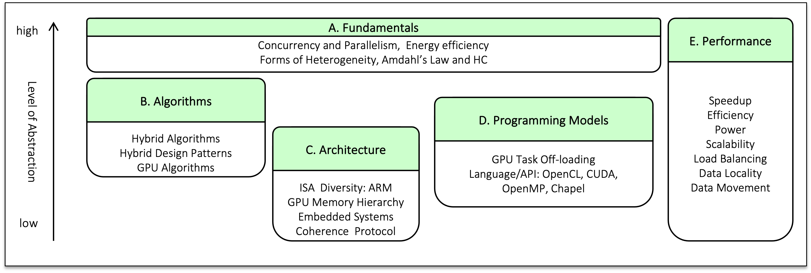

## ToUCH HC Teaching Modules

This repository hosts a collection of teaching modules covering a range of topics in Heterogeneous
Computing. The modules are primarily intended for undergraduate Computer Science and Computer
Engineering students. They were developed as part of the NSF-funded ToUCH project.

The following document gives an overview of the modules and discusses the guiding principles and the
motivation behind their design. 

*  [ToUCH:Teaching Undergrads Collaborative and Heterogeneous Computing](./touch_overview.pdf)  
   Apan Qasem, David Bunde, Phil Schielke

### Module Categories 

The modules are classified into five broads areas

* [Fundamentals](./Fundamentals)
* [Algorithms](./Algorithms)
* [Architecture](./Architecture)
* [Programming Models](./Programming)
* Performance

Modules in each category are located in their respective sub-directories 

### Module List

Below is the current list of modules. The module list is updated frequently. If you want to
contribute a module, please contact Apan <apan@txstate.edu> 

* [Fundamentals](./Fundamentals)
     * [[A1] Heterogeneous Computing: Elementary Notions](./Fundamentals/elementary_notions)
     * [[A2] Task Mapping on Soft Heterogeneous Systems](./Fundamentals/task_mapping)
     * [[A3] Pollack's Rule as a Justification for Heterogeneous Computing](./Fundamentals/pollacks_rule)
* [Algorithms](./Algorithms)
     * [[B1] Hybrid Algorithms](./Algorithms/hybrid_algorithms)
* [Architecture](./Architecture)
     * [[C1] Introduction to ARM](./Architecture/arm_introduction)
     * [[C2] GPU Memory Hierarchy](./Architecture/gpu_memory_hierarchy)
* [Programming Models](./Programming) 
     * [[D1] Introduction to CUDA Programming](./Programming/cuda)
     * [[D2] Heterogeneous Programming with OpenMP](./Programming/openmp)

* Performance
    
	
### Publications	

Apan Qasem. _A Gentle Introduction to Heterogeneous Computing for CS1 Students_ in 
IEEE/ACM Workshop on Education for High-Performance Computing, (EduHPC@SC 2019), 2019.
[doi:10.1109/EduHPC49559.2019.00007](https://ieeexplore.ieee.org/document/8943087)

Apan Qasem, David Bunde and Phil Schielke. _ToUCH: Teaching Undergrads Collaborative and Heterogeneous
Computing_ in Consortium for Computing Sciences in Colleges South Central Conference
(CCSC19), 2019. 

Shield: [![CC BY 4.0][cc-by-shield]][cc-by]

This work is licensed under a
[Creative Commons Attribution 4.0 International License][cc-by].

[![CC BY 4.0][cc-by-image]][cc-by]

[cc-by]: http://creativecommons.org/licenses/by/4.0/
[cc-by-image]: https://i.creativecommons.org/l/by/4.0/88x31.png
[cc-by-shield]: https://img.shields.io/badge/License-CC%20BY%204.0-lightgrey.svg
